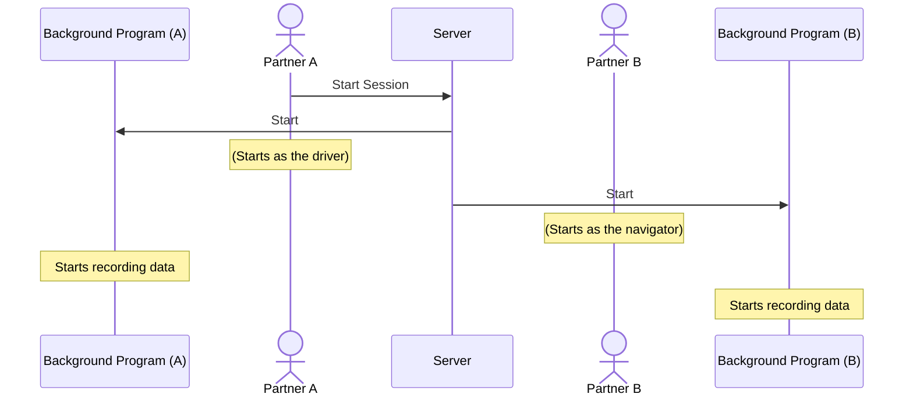
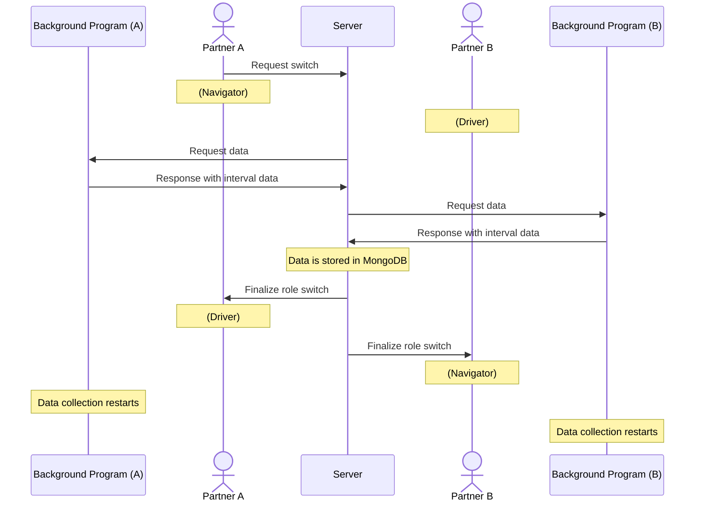

# Procedure

_A check mark ✅ means the step is implemented/can be performed using the current version of the codebase._

## Setup

1. ✅ Pair up computers, where one is Partner A and the other is Partner B
2. ✅ Copy each ID from the web app to the Python program
3. ✅ Copy Partner A's unique ID and paste it into the text field on Partner B's computer

## During the study

Partner A will start out as the driver.

4. ✅ Partner A clicks the "Start Session" button, which starts the session for both participants.
5. ✅ At any point during the study, participants can switch between driver and navigator.
   - ✅ When this happens, the frontend sends a WebSocket message to the backend.
   - ✅ Then, the backend will send a WebSocket message to Partner A and B requesting data from the last interval.
   - 🗙 The Python programs running on the background on both machines will reply.
   - ✅After replies are received from both Partner A and B, the backend commits this information in MongoDB.
   - ✅ Then, the backend sends a follow-up message to both computers indicating the start of a new interval with reversed roles.

### Starting the session

### Switching roles

## Web-based Interface

The web interface will be embedded as a WebView in a VS Code extension. It will rely on polling to fetch data from the backend and show it to the user when the extension's panel is open.
