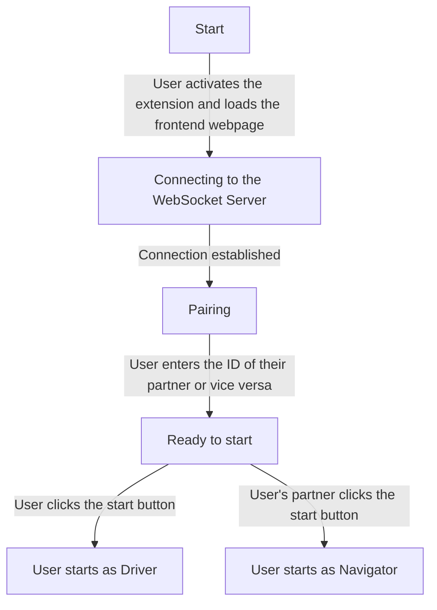

# GenderTool Project Documentation

_Written by Brendan Swanson · Last Updated August 18, 2023_

## Architecture

The project is separated into four parts, each of which has its own folder in the [repository](https://github.com/Farissoliman/PairProgrammingTool/):

- The WebSocket server
  - [Node.js](https://nodejs.org/en) script
- The Frontend (the frontend folder)
  - [Next.js](https://nextjs.org/) app built with TypeScript
- The facial/voice/keystroke recognition program
  - Built with Python
- The VSCode extension
  - Node.js package built with the [official extension template](https://github.com/microsoft/vscode-extension-samples) (webview-view-sample)

[](https://excalidraw.com/#json=7uTiwDlmZl-uNPU9GpV-Q,rWrpn1cKESmfxuW-RoEL5g)

## Intervals

- All collected data is stored as a list of intervals.
- When a new session starts or when the partners switch roles, a new interval is started.
- When a new interval starts, all data collected from the last interval (if it exists) is stored in the database. This removes the need to constantly update the database as soon as new data comes in, and it makes it easier to analyze when partners switched roles and for how long they occupied each role.

## Function

### WebSocket Server

- Handles all realtime communication
- For each client, the WebSocket server is simultaneously connected to the frontend and the recognition program.
- See detailed WebSocket protocol documentation [here](https://github.com/Farissoliman/PairProgrammingTool/blob/main/docs/API.md#websocket-api).

### Frontend

- Displays all available information to the user
- Once the session has ended, displays a summary of both partners' statistics
- Exposes an API endpoint to get a user's statistics; see an example request and response [here](https://github.com/Farissoliman/PairProgrammingTool/blob/main/docs/API.md#get-apistatsuid).

### Recognition Program

- Waits for a message from the WebSocket server indicating that the session has started.
- Once the session starts, data collection is enabled. The program collects many different types of data:
  - [Speech recognition](https://github.com/Farissoliman/PairProgrammingTool/blob/main/recognition/speech_detection.py) (internally uses Google's speech-to-text API)
  - [Facial recognition](https://github.com/Farissoliman/PairProgrammingTool/blob/main/recognition/face_detection.py) (client-side emotion detection)
  - [Keystroke logging](https://github.com/Farissoliman/PairProgrammingTool/blob/main/recognition/keystroke_counter.py)
- Each type of data collection is its own file in the [`recognition` folder](https://github.com/Farissoliman/PairProgrammingTool/tree/main/recognition). They all define a class with the following methods:
  - `start` - Begin data collection, and open any necessary devices or listeners
  - `collect` - Must return all stored data, which will be added to the current interval
  - `reset_state` - Code to reset all stored data; called after collect
  - `stop` - Code to run when the session has ended and data collection should stop completely

### VSCode Extension

- Adds an activity to the sidebar which contains a panel
- This panel contains a WebView, which is set to request a webpage from the frontend.
- The frontend and VSCode extension use the [postMessage API](https://developer.mozilla.org/en-US/docs/Web/API/Window/postMessage) to exchange information about the client and partner's UIDs.

## Possible States

### Before the Session Starts



### During the Session

During the session, users have two options: switch places and end the session.

### Switching Places

1. The user sends a request to switch roles to the WebSocket server.

2. The WebSocket server requests data from the recognition programs running on both clients and awaits their responses.

3. When the recognition programs on each client receive this request, they call thecollect method on each data collector and reply with the combined data from all sources.

4. Once _both_ clients have replied with data from the most recent interval, the WebSocket server broadcasts a message to request the start of a new interval. This causes two actions to occur:

   1. On the frontend, the data from the most recent interval is refreshed and used to populate the UI.
   2. In the recognition program, all accumulated data is reset and a new interval is started. Data collection resumes.

## Installation (to run locally)

First, you need to set some environment variables. Create a file called `.env.local` and add the following:

```env
WS_SERVER_ADDRESS=ws://localhost:3030
```

Variables which are meant to be committed to the repository can be found in `.env.public`. The contents of `.env.local` should stay on your machine and _not_ be committed to this repo.

The easiest way to run locally is via Docker:

```sh
docker compose up
```

This will spin up a MongoDB database, the WebSocket server, and the frontend application, each in its own Docker container.

When you change the code, you can run `docker compose up --build`, which will take care of rebuilding the images for you.

When you want to test the recognition program, start it like this:

```sh
cd recognition
source bin/activate
python3 run.py <your-unique-identifier>
```

To test the extension, open its folder as a VSCode project:

```sh
code extension
```

Press F5 to launch a new VSCode window with the extension installed.

## Installation (Production)

### Server-side

Both server-side projects, the WebSocket server and the frontend, are packaged as [Docker](https://www.docker.com/) containers. This means that, once you install Docker, you can deploy with one command.

1. Clone the repository on your server:

```sh
git clone https://github.com/Farissoliman/PairProgrammingTool/
```

2. Create a `.env.local` file in the root of the project containing a key-value pair with the WebSocket server's URL:

```env
WS_SERVER_URL=ws://lin-res128.csc.ncsu.edu:3030
```

3. Run `docker compose up` in the root of the project. This will build and run both containers.

4. Expose ports `3000` and `3030` on your server's firewall.

   - The web server runs on port `3000` and the WebSocket server runs on `3030`.
   - If you want to run the web server on the default HTTP ports, 80 and 443, you will need root access on your server.
   - On NCSU servers, this will require contacting the IT department.

If you want to run the server-side projects without maintaining a terminal session/SSH connection to the server, you can add the `-d` flag to your Docker compose command:

```sh
docker compose up -d
```

This will run it in [detached](https://docs.docker.com/engine/reference/commandline/compose_up/#options) mode, keeping the containers alive in the background.

### Client-side

On each client's computer:

1. Clone the repository:

```sh
git clone https://github.com/Farissoliman/PairProgrammingTool/
```

2. Open up VSCode to the extension directory (**Note**: You may have to change the WebSocket server address in the extension code - it's located [here](https://github.com/Farissoliman/PairProgrammingTool/blob/7c911b3d6e2632dc9da1c9a9f38475a6d7871a9e/extension/src/extension.ts#L6)):

```sh
code ./extension
```

3. Press F5 to open a new VSCode window with the extension installed
4. Click on the extension's icon (looks like [this](https://raw.githubusercontent.com/Farissoliman/PairProgrammingTool/main/extension/resources/user-group-solid.svg)) on the left-hand side
5. When it loads, copy the user's UID
6. Open a terminal
7. Run the setup script to install any necessary dependencies:

```sh
./recognition/setup.sh
```

8.  Activate the Python virtual environment:

```sh
source ./recognition/bin/activate
```

9.  Start the recognition program:

```sh
python3 ./recognition/run.py
```
