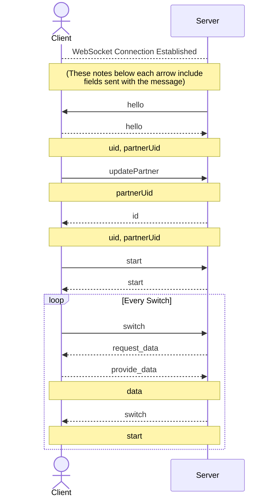

# API Documentation

#### GenderTool Backend

## Definitions

Every user has a unique **`uid`**. It can be of any format, as
long as it's a string that MongoDB will accept as an ObjectId.

This `uid` is used to access a user's statistics and to post
new ones to their document.

## `GET /api/stats/:uid`

Returns all the user's recorded stats. No query parameters or request body is necessary.

**Example response:**

```json
{
  "userId": "test_user_0001",
  "session_start": 1688531280787,
  "intervals": [
    {
      "status": "driver",
      "start": 1688531280787,
      "lines_written": 9,
      "utterances": [1688531280787, 1688531285787, 1688531290787]
    }
  ]
}
```

- `userId` is the user's `uid`.
- `session_start` is a Unix timestamp of when the session started.
- `intervals` is an array of `Interval` objects, containing info about each time the user was either driver or navigator.
  - `status` represents the user's role during the interval.
  - `start` is a Unix timestamp representing the time the interval started.
  - `lines_written` is the number of lines of code that the user wrote during the interval. Should only be >0 when `status` is `driver`, but this isn't enforced.
  - `utterances` is an array of Unix timestamps representing the times of each words. Used for interruption detection.

## `POST /api/update/:uid`

Adds some new data to the user's intervals,
allowing them to view updated statistics.

This should be called for each user,
but only when they switch positions (driver <-> navigator)
OR when the session ends.

**Example request body**
The request body should be a JSON-formatted `Interval`.

```json
{
  "status": "driver",
  "start": 1688531280787,
  "lines_written": 9,
  "utterances": [1688531280787, 1688531285787, 1688531290787]
}
```

No response should be expected. After this endpoint is called
successfully, the response of `GET /api/stats/:uid` should
include the new information.

## WebSocket API

The project also contains a WebSocket server, which listens by default on `127.0.0.1:3030`. Messages are sent and received in a JSON format, and each message must contain an `action` field.

In the `Direction` column: "C" = client, "S" = server.

| `action`         | Direction | Description                                                                                                                                                                            | Other fields                                                                                  |
| ---------------- | --------- | -------------------------------------------------------------------------------------------------------------------------------------------------------------------------------------- | --------------------------------------------------------------------------------------------- |
| `hello`          | S&rarr;C  | Signals that the client connected successfully and requests that the client reply with UID information. The client will reply with its own `hello` message (see next row).             | None                                                                                          |
| `hello`          | C&rarr;S  | Gives the server UID information                                                                                                                                                       | `uid`: The UID of the client; <br> `partnerUid` (optional): The UID of the partner, if known. |
| `update_partner` | C&rarr;S  | Gives the partner's UID to the server. Only applies to the current connection; i.e. would have to be resent when reconnecting. The server will respond with an `id` message.           | `partnerUid`: The UID of the partner                                                          |
| `id`             | S&rarr;C  | Updates the client with their partner's UID. This signals that partners are now able to start the session.                                                                             | `uid`: The UID of the client; <br>`partnerUid`: the UID of the partner.                       |
| `start`          | C&rarr;S  | Starts the session for the user and their partner. This will cause a MongoDB document to be created for both partners. The server will respond to both clients with a `start` message. | None                                                                                          |
| `start`          | S&rarr;C  | Signals that the session has started.                                                                                                                                                  | None                                                                                          |
| `switch`         | C&rarr;S  | Requests that the driver and navigator switch places. The server will respond to both clients with a `request_data` message.                                                           | None                                                                                          |
| `request_data`   | S&rarr;C  | Asks the client to provide all the collected data over the most recent interval. The client must respond with a `provide_data` message.                                                | None                                                                                          |
| `provide_data`   | C&rarr;S  | Responds to the server's requets and provides interval data to be added to the MongoDB document. Once both clients provide data, the server will respond with a `switch` message.      | `data`: a JSON object with interval information                                               |
| `switch`         | S&rarr;C  | Tells both clients that a new interval may start at the provided timestamp (which should be slightly in the past). Driver and navigator should switch roles at this time in the UI.    | `start`: A Unix timestamp of the new interval's start time, including milliseconds            |



_Note_: Dotted arrows indicate a response to the previous message.
